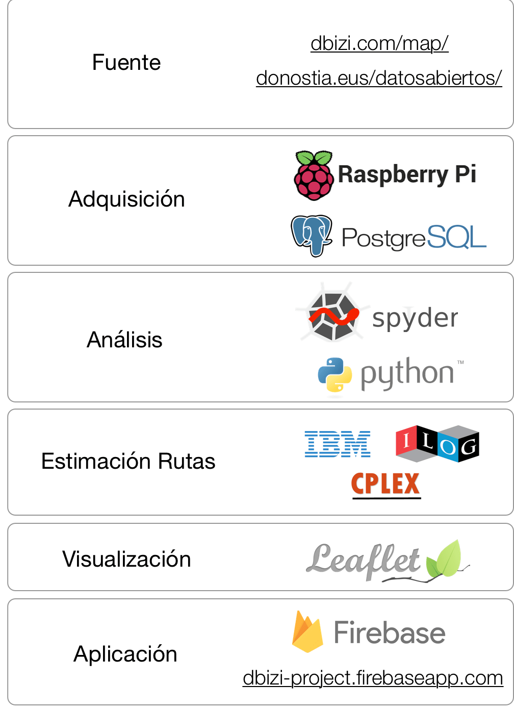

 

[dBizi](https://www.dbizi.com/) is the **public electric bicycle loan service** in the city of San Sebastian, Spain.

Currently, dBizi users can know in real time, with a frequency of 5-6 minutes, the availability of bicycles in the 16 stations of the city. This information does not guarantee the user to have bicycles in their departure station, given the influx of users at certain times. In the same way, it is possible that the user finds himself without available bases in which to park his bicycle.

[dBizi++](https://dbizi-project.firebaseapp.com/) is presented as an **application for consultation and planning of bicycle trips** with dBizi. This service uses available bicycle data in order to guarantee the availability of the service at all times, and for all users. The application informs the user of the viability of their journey, using historical data and in real time.

The project is intended for dBizi users as well as for the maintenance of the bicycle system. This extension of the dBizi service allows users to estimate if they will have bicycles when they arrive at their departure station and if, given a destination station, they will have free bases to park their bicycles.

Likewise, the information entered by the user in the application will allow the maintainer to know in advance the possible trips of the users and plan actions to guarantee the availability of bicycles and free bases.

Project Goals
----------------

- **For users**: Improve the availability of the dBizi service

- **For the maintainer** of the system: Know the most used stations, the most common routes between users and periods of greatest use of the service.

App Features
----------------

- Check the feasibility of a trip in real time.

- Possibility of reserving, at low cost, a specific route: source station, destination station, and estimated time.

- Visualization of the journeys made by bicycle in the city, illustrating the most used bicycle lanes with heat maps.

Methodology
==========================

 

Data Sources
----------------
The data of this project has been extracted from the service of [Open Data of San Sebastián City Council](http://www.donostia.eus/ataria/es/web/donostia-data/hasiera). Specifically, we have obtained the [network of bike lanes](https://www.donostia.eus/datosabiertos/catalogo/carriles-bici) (.kml), the [public bicycle parking](https://www.donostia.eus/opendata/catalog/carparks-public-bicycles) of the city (kml), and the [availability of bicycles](http://www.donostia.eus/ataria/es/web/donostia-data/dbizi-geltokiko-bizikleta-libreak) in real time (.json)

 

DBizi users pay based on their use of the service. Obviously, the dBizi computer system records at some point the departure and arrival times of each user (I do not know if the stations are also registered). However, this personal information of each user is inaccessible to the public. It should be noted that this project has estimated the trips made using only the number of bases available in each station, and not personal data of users.

Data Acquisition
---------------------

Despite having the availability of bicycles in real time, the open data service does not offer the possibility of accessing historical data. That is why, in order to study the viability of this project, a simple data acquisition platform has been developed in a [Raspberry Pi](https://www.raspberrypi.org/products/raspberry-pi-1-model-b-plus/). This platform checks, with a regular frequency, if the real-time data has undergone any change, in which case, this information is stored in a database [PostgreSQL](https://www.postgresql.org/) with format JSON With this platform, data has been stored for two weeks in June 2018.

Data Analytics
------------------

Tras la obtención de datos, se ha realizado un análisis exploratorio y de limpieza en Python. Por un lado, se han extraído las variables más interesantes para este estudio: longitud y latitud de las estaciones, y disponibilidad de bases libres (u ocupación de bases enganchadas). En este sentido, se ha visto que la suma de bases libres y bases enganchadas no se mantiene constante al número de bases totales en cada estación. A pesar de que pueda haber un retraso en la actualización de los datos, no se han visto un patrón aclaratorio.

Route Estimation Algorithm
------------------------------

The data used for this algorithm are: In a given time *t*, a change in the number of available docks *k* in an station *s* is registered. If this change is positive, it is considered that the number of free docks increases.
With these data, and considering that a user will not return to the same station from which he left, the set of all possible trips *X* is built

where *sA* , *sB* are the origin and destination stations, and *tu* , *tv*  the departure and arrival times. With this, considering a limited time (dBizi daily service from 06:30 to 23:00 hours), the following problem of whole linear optimization has been solved by means of [IBM ILOG CPLEX](https://www.ibm.com/es-es/marketplace/ibm-ilog-cplex)

Each trip *xi* is assigned with a 1 if it is completed and with a 0 on the contrary. The cost of a trip *ci* is calculated as the difference between the estimated duration of the trip in bicycle between the stations *sA* and *sB* and the time difference *tu* - *tv* This duration has been estimated with the [GraphHopper API](https://graphhopper.com/api/1/docs/).

The minimization is subject to: 

Where  *xj* is any trip that starts in *s*, in a time *t* and ends in any station other than *s*, in a time posterior to *t*.

Where  *xj* is any trip that ends in *s*, in a time *t* and starts in any station other than *s*, in a time prior to *t*.

DataViz
-----------------

For the visualization, the [Leaflet.js library](https://leafletjs.com/) has been used, using a temporary visualization module ([TimeDimension](https://github.com/socib/Leaflet.TimeDimension)), has allowed to include the trips of each bicycle on the map of San Sebastian. On the other hand, the frequency graphs and statistics of the exploratory analysis have been obtained by means of [Matplotlib](https://matplotlib.org/) of Python.

Web App
------------------

Finally, the [web application](http://dbizi-project.firebaseapp.com/) has been developed using the service [Google Firebase](https://firebase.google.com/). Currently the web only illustrates the project and the concept of the application.

